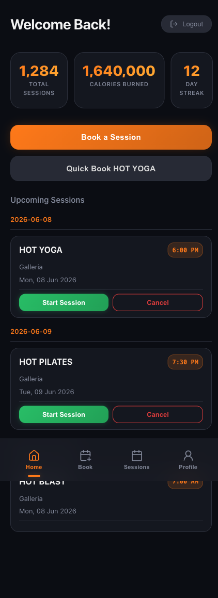
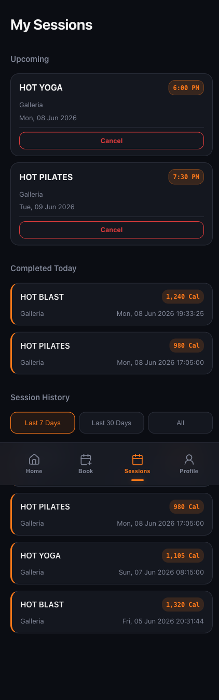
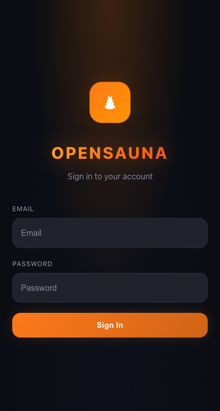

# OpenSauna

A desktop app — and reusable Rust library, and Claude Code MCP server — for
managing your HOTWORX sessions. Book faster, track better, skip the phone.

An unofficial, open-source HOTWORX client that books multiple sessions at once,
rebooks in one tap, and tries to do the basics the official app fumbles — see
[**Why OpenSauna exists**](docs/why-opensauna.md).

## What's in this repo

This is a Cargo workspace with three pieces:

| Piece | Path | What it is |
|---|---|---|
| **OpenSauna** | `src/`, `src-tauri/` | The desktop app — Leptos 0.7 frontend (WASM) inside a Tauri 2 webview, native Rust backend |
| **`hotworx-api`** | [`crates/hotworx-api/`](crates/hotworx-api) | Reusable Rust SDK for the HOTWORX member API. Used by both pieces below. |
| **`hotworx-mcp`** | [`hotworx-mcp/`](hotworx-mcp) | Model Context Protocol server so Claude Code (and other MCP clients) can drive HOTWORX |

The desktop app is the headline feature. The crate exists so other people can
build their own HOTWORX tools without re-implementing the wire protocol.

## Disclaimer

Not affiliated with, authorized, or endorsed by HOTWORX. Unofficial client; use
at your own risk — it may conflict with HOTWORX's Terms of Service. Provided
as-is, without warranty — see [LICENSE](LICENSE) and [NOTICE](NOTICE).

Your data stays between you and HOTWORX — see [PRIVACY.md](PRIVACY.md).

## Screenshots

| Dashboard | Sessions |
|:---:|:---:|
|  |  |

| Sign In | Verify OTP |
|:---:|:---:|
|  |  |

<sub>Screenshots use demo data.</sub>

## Features

- Desktop booking — pick your studio, workout, and time slot without squinting at your phone.
- Quick Book — one tap to rebook your usual session.
- Multi-slot selection — book several time slots in one go.
- Live session timer with calorie and heart rate tracking.
- Activity history with date filters.
- Profile and goals editing.
- Encrypted token storage (AES-256-GCM).
- Cross-platform: macOS, Windows, Linux, Android.
- Drives via Claude Code through the bundled MCP server.

## Getting started

### Prerequisites

- [Rust](https://rustup.rs/) (stable)
- WASM target: `rustup target add wasm32-unknown-unknown`
- [Trunk](https://trunkrs.dev/): `cargo install trunk`
- [Tauri CLI v2](https://v2.tauri.app/): `cargo install tauri-cli`
- Linux (Ubuntu/Debian) only: `sudo apt-get install libwebkit2gtk-4.1-dev libappindicator3-dev librsvg2-dev patchelf`. macOS and Windows have no extra system packages.

### Run the desktop app

```
cargo tauri dev
```

Hot reload, opens OpenSauna pointed at the real HOTWORX API.

### Production build

```
cargo tauri build
```

Outputs `target/release/bundle/macos/OpenSauna.app` (and a DMG) on macOS,
equivalents on other platforms.

### Use just the SDK

```toml
[dependencies]
hotworx-api = { path = "crates/hotworx-api" }
```

See [`crates/hotworx-api/README.md`](crates/hotworx-api/README.md) for the
full API surface and a usage example.

### Wire up the MCP server

```bash
cargo install --path hotworx-mcp
claude mcp add hotworx hotworx-mcp
```

See [`hotworx-mcp/README.md`](hotworx-mcp/README.md) for the tool list and
authentication flow.

### Installing a release

macOS and Android builds are code-signed (notarized DMG / signed APK). The
**Windows** installer is unsigned, so SmartScreen may warn on first launch —
click **More info → Run anyway**. See [`docs/SIGNING.md`](docs/SIGNING.md).

### Android

CI builds signed APKs on pushes to `main` and on tagged releases. See
[`.github/workflows/ci.yml`](.github/workflows/ci.yml). To build locally
you'll also need the Android SDK, NDK 27, and the `aarch64-linux-android`
Rust target.

## How it's built

**Frontend.** Leptos 0.7 compiled to WASM, running client-side in a Tauri
webview. No JS framework — it's all Rust. Pages call the native backend
through Tauri IPC; the WASM frontend never contacts HOTWORX directly.

**Native backend.** Tauri 2.0 process. Owns token-at-rest encryption,
device-id persistence, local session-tracking state, and the IPC command
surface. Each `api_*` command is a thin wrapper around `HotworxClient` from
the `hotworx-api` crate.

**SDK.** [`hotworx-api`](crates/hotworx-api) is a typed, transport-only
client for HOTWORX. It owns the wire protocol, the Android-app header
spoofing, and the response models. Both the desktop backend and the MCP
server consume it as a path dependency.

**MCP server.** [`hotworx-mcp`](hotworx-mcp) is a separate binary that
exposes a small `hotworx_*` tool family over MCP stdio.

### Directory layout

```
.
├── src/                              # Frontend (Leptos → WASM)
│   ├── components/                   # Reusable UI
│   ├── models/                       # WASM-side typed shapes
│   ├── pages/                        # Route pages
│   ├── state/                        # Reactive app state (auth, session)
│   ├── utils/                        # Shared helpers (Tauri bindings, dates, nav)
│   ├── app.rs                        # Router + layout
│   └── main.rs                       # Entry point
│
├── src-tauri/                        # Native Rust backend for the desktop app
│   └── src/lib.rs                    # IPC commands + token encryption + storage
│
├── crates/hotworx-api/               # Reusable HOTWORX SDK
│
└── hotworx-mcp/                      # MCP server for Claude Code
```

Architecture details and rationale live in
[`docs/ARCHITECTURE.md`](docs/ARCHITECTURE.md).

## License

[MIT](LICENSE).
