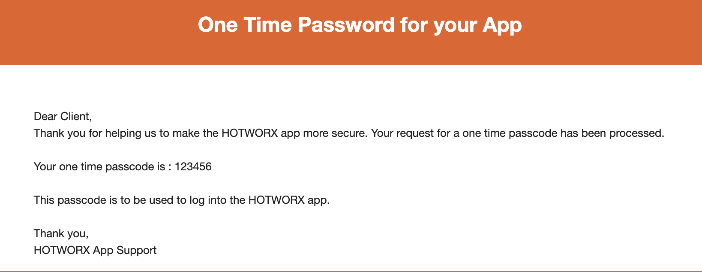

# Why OpenSauna exists

A friend texts me the sessions he just booked. To match them in the official app, I poke tiny buttons one slot at a time — and the "group" booking that's meant to let us book together has never once worked for me.

So I built OpenSauna: an unofficial, open-source HOTWORX client for desktop and mobile that books **multiple sessions at once**, rebooks your usual in one tap, and otherwise gets out of the way.

While I was reverse-engineering the API to do that, I wrote down what I found — all observable in the shipped app as of **v6.6.3 (June 2026)**:

- **The "2FA" is a formality.** HOTWORX emails you a one-time passcode that is `123456`. Every single time. Their own email says so:

  

  > Thank you for helping us to make the HOTWORX app more secure. […] Your one time passcode is : 123456

  There's no authenticator-app option, and the code isn't meaningfully validated. That's the entire second factor.
- A fresh device identity on every login, so "remember this device" never sticks and you're re-prompted endlessly.
- Passwords hashed once, client-side, unsalted, then sent as a static, reusable credential.
- Errors returned with "success" HTTP statuses; the same endpoint changes shape between versions.
- UI strings in non-native English ("Please input your email ID"), SDK jargon in user-facing errors, a contractor's email and a vendor API key left hardcoded in the shipped app — it reads outsourced and unreviewed.

The basics aren't hard. I build things, so here we are.

---

*OpenSauna is unofficial and not affiliated with or endorsed by HOTWORX. It uses your own credentials to talk to the same member API the official app uses. Use at your own risk — it may conflict with HOTWORX's Terms of Service, and your account is your responsibility. See [NOTICE](../NOTICE).*
